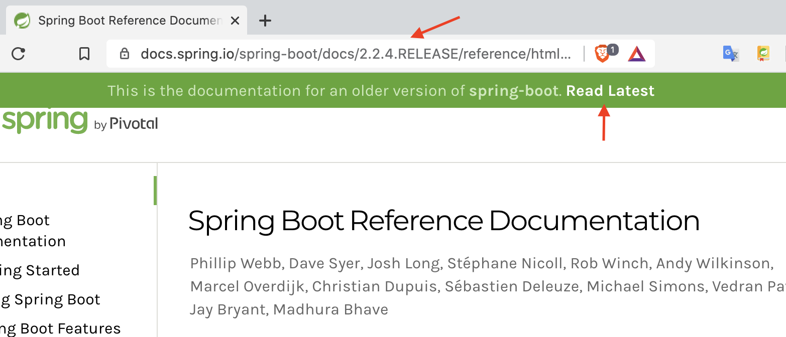

# Spring Docs Read Latest Chrome Extension

Chrome extension that adds link to the latest reference docs in older versions of Spring reference documentation.

Works for:

- Spring Framework
- Spring Boot

 

# Spring Docs Read Latest Safari Web Extension

The Safari Extension has been created by the [CLI](https://developer.apple.com/documentation/safariservices/safari_web_extensions/converting_a_web_extension_for_safari) tool `xcrun safari-web-extension-converter` from Apple.

To run the extension locally you need to follow the steps provided [here](https://developer.apple.com/documentation/safariservices/safari_web_extensions/running_your_safari_web_extension).